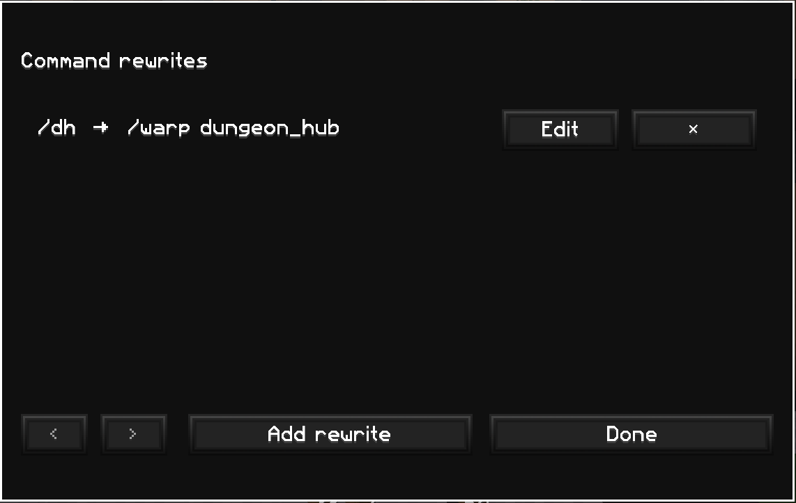

# Rewrite

<p align="center">
  
</p>

A small client-side Fabric mod that turns short commands into longer server commands.

Create an alias such as `hub` → `warp hub`, then enter `/hub`; Rewrite sends `/warp hub` to the server. Extra arguments are preserved, so `/island invite Alex` can rewrite to `/skyblock island invite Alex`.

## Usage

1. Install Fabric Loader and Fabric API. Mod Menu is optional.
2. Put the Rewrite jar in `.minecraft/mods`.
3. Join a world or server and run `/rewrite`.
4. Add, edit, or remove command aliases in the menu.

Aliases are stored in `.minecraft/config/rewrite.json`. The same settings screen is available from Mod Menu's config button.

## Requirements

- Minecraft 26.1.2
- Fabric Loader 0.19.3+
- Java 25
- Fabric API
- Mod Menu 18.0.0+ (optional)

## Build

```sh
./gradlew build
```

The built jar will be in `build/libs/`.

## License

Source available for personal, non-commercial use only. See [LICENSE](LICENSE).
